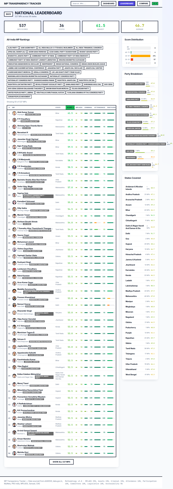
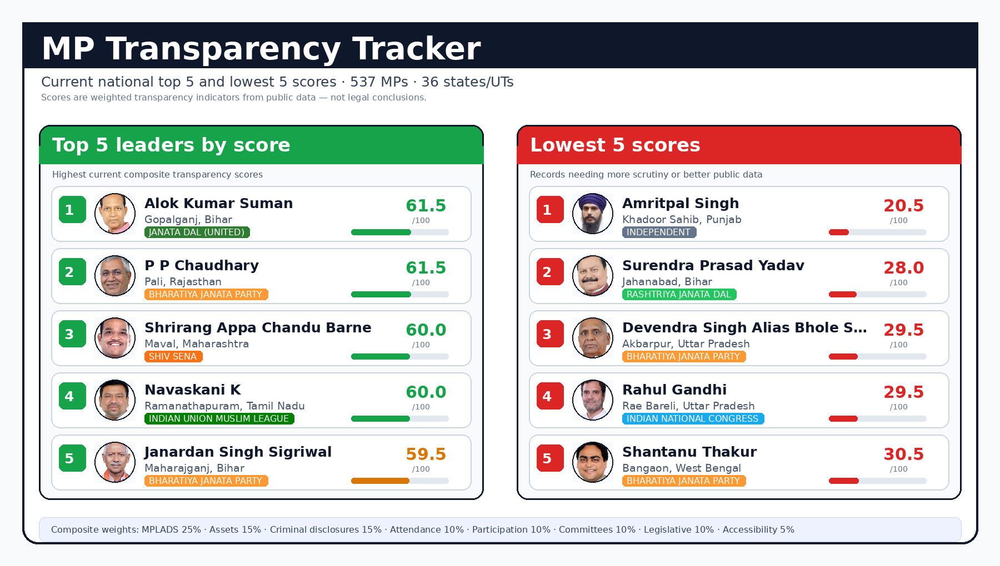

# MP Transparency Tracker

A reproducible, open-data transparency ranking system for Indian Members of Parliament.

The project collects public records for MPs, normalizes them into auditable JSON, computes a weighted 0-100 transparency score, and publishes a static dashboard for citizens, researchers, journalists, and contributors.

Live site: https://neta-gym.github.io/mp-transparency-tracker/





## What this project is trying to do

Public information about MPs is scattered across Parliament portals, affidavit sites, MPLADS data, PRS-style activity records, and other public datasets. A voter should not need to manually reconcile all of those sources to answer simple questions like:

- Who are the highest-scoring MPs on measurable transparency indicators?
- Which MPs have red flags that deserve closer public scrutiny?
- How do parties, states, and constituencies compare?
- Which parts of the score are backed by strong evidence, and which need better data?

MP Transparency Tracker turns that fragmented public information into:

- state leaderboards
- a national leaderboard
- per-MP score JSON
- per-MP markdown reports
- an interactive static dashboard
- reusable source connectors and scoring code

The motive is not to declare a final moral judgment on any MP. The motive is to make public records easier to inspect, compare, verify, and improve.

## Current national snapshot

Generated from `data/national/leaderboard/latest.json`.

- MPs scored: 540
- States/UTs covered: 36 / 36
- Average national score: 39.8 / 100
- Highest current score: 59.5 / 100
- Snapshot timestamp: 2026-05-23T18:23:39.289312Z

Top 10 in the current national ranking:

| Rank | MP | Party | State | Constituency | Score |
|---:|---|---|---|---|---:|
| 1 | Rajiv Pratap Rudy | Bharatiya Janata Party | Bihar | Saran | 59.5 |
| 2 | Sukhdeo Bhagat | Indian National Congress | Jharkhand | Lohardaga | 57.6 |
| 3 | C N Annadurai | Dravida Munnetra Kazhagam | Tamil Nadu | Tiruvannamalai | 57.5 |
| 4 | Arun Kumar Sagar | Bharatiya Janata Party | Uttar Pradesh | Shahjahanpur | 57.0 |
| 5 | Chandra Shekhar | Azad Samaj Party (Kanshi Ram) | Uttar Pradesh | Nagina | 56.6 |
| 6 | Tapir Gao | Bharatiya Janata Party | Arunachal Pradesh | Arunachal East | 55.1 |
| 7 | Alok Kumar Suman | Janata Dal (United) | Bihar | Gopalganj | 55.0 |
| 8 | Rajesh Mishra | Bharatiya Janata Party | Madhya Pradesh | Sidhi | 54.3 |
| 9 | Shrikant Eknath Shinde | Shiv Sena | Maharashtra | Kalyan | 54.0 |
| 10 | Mohammad Jawed | Indian National Congress | Bihar | Kishanganj | 53.4 |

The scores are intentionally conservative. A score near 60 currently means “stronger than peers on available measurable indicators,” not “perfect transparency.” Missing or weakly evidenced public data can keep scores lower.

## How the ranking works

Each MP receives component scores from 0 to 100. The composite score is a weighted average defined in `src/tracker/config.py`:

| Component | Weight | What it is meant to capture |
|---|---:|---|
| MPLADS fund utilization | 25% | Whether available constituency development funds appear used effectively and transparently. |
| Asset declarations/growth | 15% | Public affidavit-linked asset signals and declaration consistency. |
| Criminal record disclosures | 15% | Declared criminal cases and severity signals from public affidavit-linked data. |
| Parliament attendance | 10% | Attendance signals where available, with ministerial context handled in code. |
| Parliamentary participation | 10% | Questions/debates participation signals from parliamentary activity data. |
| Committee participation | 10% | Committee membership/participation where available. |
| Legislative activity | 10% | Bill/legislative activity signals where available. |
| Public accessibility | 5% | Public-facing contact/social/accessibility signals. |

Important interpretation notes:

- Higher score means stronger measured transparency/performance on this project’s selected indicators.
- The score is only as good as the public data available and the mapping quality for that MP.
- Component scores are kept visible so users can see why a composite score is high or low.
- `data_confidence` is separate from the composite score and reflects source/evidence confidence.
- The leaderboard is a starting point for scrutiny, not a substitute for source-level verification.

Core scoring implementation:

- weights: `src/tracker/config.py`
- component calculations: `src/tracker/agents/assessor.py`
- leaderboard assembly: `src/tracker/agents/manager.py`
- exported national data: `data/national/leaderboard/latest.json`

## Data sources

The pipeline is designed to be open-data first and reproducible. It should not require paid LLM/API dependencies.

Primary source families include:

- Digital Sansad / Sansad member data
- MyNeta affidavit-linked election records, including constituency-aware matching and direct candidate-page fallbacks for high-confidence mappings
- PRS/parliamentary activity style datasets
- MPLADS/eSAKSHI public expenditure datasets, with spelling/suffix normalization for constituency names
- data.gov.in and other public-domain government datasets where available
- public MP profile/contact/social records where available

Source connectors live under `src/tracker/tools/`. Generated findings and reports retain enough structure to inspect evidence and confidence.

## Repository structure

```text
src/tracker/                    Core Python package
src/tracker/agents/             Pipeline stages: discovery, research, validation, scoring, reporting
src/tracker/tools/              Public-data connectors and scrapers
src/tracker/storage/            Persistence helpers
tests/                          Unit/integration tests
scripts/                        Operational refresh/enrichment/rescoring scripts
data/                           Generated state and national outputs
dashboard/                      Next.js 15 static dashboard
.github/workflows/              CI and GitHub Pages deployment
docs/assets/                    README and documentation images
```

## Generated data layout

For each state/UT:

```text
data/{state-slug}/raw/          Raw and validated MP records
data/{state-slug}/scores/       One score JSON per MP
data/{state-slug}/reports/      One markdown report per MP
data/{state-slug}/leaderboard/  latest.json, latest.md, and snapshots
```

National aggregate and enrichment/coverage diagnostics:

```text
data/national/leaderboard/latest.json
data/enrichment/coverage_after_backfill.json
```

## Quick start

Requirements:

- Python 3.10+; Python 3.11 recommended
- Node.js 20+ for the dashboard

Create a Python environment and install dependencies:

```bash
python3.11 -m venv .venv311
. .venv311/bin/activate
python -m pip install -U pip
python -m pip install -r requirements.txt pytest pytest-asyncio aioresponses
```

Run tests:

```bash
PYTHONPATH=src pytest tests -q
```

Run the tracker for one state:

```bash
PYTHONPATH=src python -m tracker.main --state delhi --format json
```

Run the tracker for all states:

```bash
PYTHONPATH=src python -m tracker.main --all-states --format json
```

Run using a display-name state value if needed:

```bash
PYTHONPATH=src python -m tracker.main --state "Uttar Pradesh" --format json
```

## Dashboard

The dashboard is a static Next.js export generated from `data/`.

Build locally:

```bash
cd dashboard
npm ci
npm run build
```

Preview the static export:

```bash
npx serve@latest out -p 3000
```

Important dashboard notes:

- Use Node 20+. Next.js 15 will fail on older Node versions.
- This is a static export. Use `npx serve@latest out -p 3000`, not `next start`.
- If `data/` changes, rebuild the dashboard before judging UI output.
- GitHub Pages deploys under `/mp-transparency-tracker`, so asset paths must respect the configured base path.

## GitHub Pages deployment

Workflow:

```text
.github/workflows/deploy-dashboard.yml
```

Public URL:

```text
https://neta-gym.github.io/mp-transparency-tracker/
```

The Pages build sets:

```text
NEXT_PUBLIC_BASE_PATH=/mp-transparency-tracker
```

This is required because project Pages are served from a repository subpath. If the live page appears unstyled, maps stay stuck at “Loading map…”, or MP photos break, check that generated links point under `/mp-transparency-tracker/` rather than the domain root.

## Guide for AI coding agents: Codex, Claude Code, and similar tools

If you are an automated coding agent reading this repository, preserve these project invariants:

1. Do not add hidden LLM dependencies to the data pipeline.
   - The tracker is meant to run from open/public data and deterministic code.
   - Avoid Claude/OpenAI/API calls for scoring, validation, or report generation unless the maintainer explicitly asks for that architectural change.

2. Treat generated data as source-backed artifacts.
   - Do not hand-edit leaderboard JSON to “fix” rankings.
   - Fix the source connector, normalization, validation, or scoring code, then regenerate outputs.

3. Keep ranking logic explainable.
   - If you change weights or component formulas, update this README and tests.
   - Users must be able to understand why an MP moved up or down.

4. Keep state/national coverage intact.
   - Current target coverage is 36 states/UTs and 540 MPs.
   - After pipeline changes, verify national aggregation still includes the expected coverage.
   - For MPLADS/MyNeta backfills, check `data/enrichment/coverage_after_backfill.json` and ensure `missing_mplads`, `missing_assets`, and `blank_name` remain 0.

5. Be careful with dashboard deployment paths.
   - Local `/` behavior differs from GitHub Pages `/mp-transparency-tracker/` behavior.
   - Public assets in `dashboard/public` and client-side `fetch()` URLs must be base-path safe.

6. Prefer small, testable changes.
   - Add or update tests for parsers, scoring rules, and data transforms.
   - Run `PYTHONPATH=src pytest tests -q` before proposing a final change.
   - For dashboard changes, run `npm run build` inside `dashboard/`.

7. Understand the ranking before modifying UI labels.
   - “Score” is the weighted composite.
   - “Confidence” is evidence/source confidence and is not the same as score.
   - The red-flag/watchlist UI is for scrutiny signals, not a legal conclusion.

8. Do not overwrite unrelated local work.
   - Check `git status --short` before edits.
   - This repository often has generated files and dashboard changes in flight.

Good first places to inspect:

```text
src/tracker/config.py                 scoring weights and source URLs
src/tracker/agents/assessor.py        score formulas
src/tracker/agents/manager.py         pipeline orchestration and leaderboard export
src/tracker/tools/                    source connectors
data/national/leaderboard/latest.json current national ranking
dashboard/src/                        public dashboard UI
```

## Development checklist

Before pushing meaningful code changes:

```bash
PYTHONPATH=src pytest tests -q
cd dashboard && npm run build
```

Before publishing data/dashboard updates:

```bash
PYTHONPATH=src python -m tracker.main --all-states --format json
# Optional targeted enrichment refresh for missing MyNeta/eSAKSHI fields:
PYTHONPATH=src python scripts/backfill_myneta_esakshi.py
cd dashboard && npm run build
```

Then inspect:

```text
data/national/leaderboard/latest.json
data/enrichment/coverage_after_backfill.json
dashboard/out/
```

## CI

CI workflow:

```text
.github/workflows/ci.yml
```

Deployment workflow:

```text
.github/workflows/deploy-dashboard.yml
```

## Contributing

Pull requests are welcome. If you want to add a feature, improve a source connector, refine the dashboard, or make the ranking methodology clearer, please raise a PR.

Useful contribution areas:

- source connector hardening
- better MyNeta/Sansad/PRS matching
- data confidence diagnostics
- scoring methodology transparency
- parser tests and fixture coverage
- dashboard usability and performance
- state/party/MP comparison views
- new public-data signals that can be reproduced without hidden paid APIs

For larger changes, open an issue or draft PR first so the scoring impact and data-source assumptions can be discussed. Please keep changes deterministic, documented, source-attributable, and aligned with open-data principles.

## License

Add the intended open-source license for this repository if not already present.
