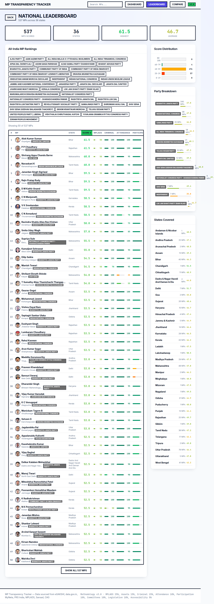
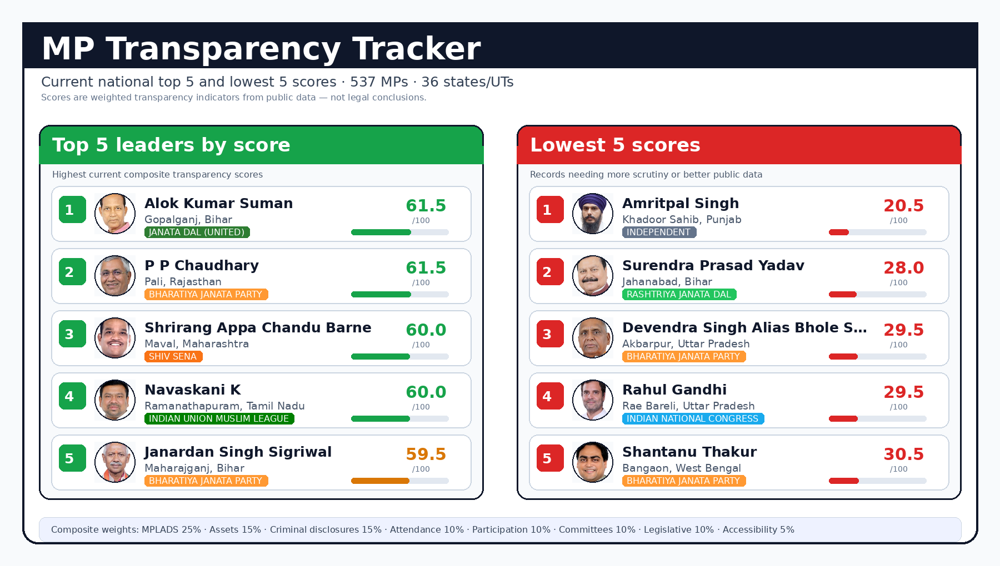

# MP Transparency Tracker

A reproducible, open-data transparency ranking system for Indian Members of Parliament.

The project collects public records for MPs, normalizes them into auditable JSON, computes a weighted 0-100 transparency score, and publishes a static dashboard for citizens, researchers, journalists, and contributors.

Live site: https://neta-gym.github.io/mp-transparency-tracker/

**Press / journalists: [Findings summary (press kit)](docs/findings.md)** - headline numbers, fund-usage leaders and laggards, criminal-case and attendance stats, methodology. Everything quotable with source links.





## Multi-App AI Agent Hackathon - NetaGym Watch (September 13, 2026)

**Demo video (2 min): [netagym_watch_demo.mp4](netagym_watch_demo.mp4)**

**Project overview.** NetaGym Watch is a multi-app agent on top of this dataset. Ask any of the 786 MPs' records by voice or text, in Hindi or English; watch specific MPs and get a digest or an alert when the public record moves. Live service: https://netagym-voice.onrender.com (text UI at `/`, voice call UI at `/talk`, reliability report at `/evals`).

**External apps used.**

- AssemblyAI - speech-to-text for the voice pipeline (`/talk`).
- Telegram - bot delivery for watches, alerts, and digest (`voice/telegram_bot.py`); email delivery (`assistant-sk@mail.instinct.com`) as the second channel.
- Render - hosts the voice/watch API (free tier; ~30s cold start).
- GitHub Pages - the public dashboard every answer links back to.

**Setup instructions.** Python 3.11+, `pip install -r requirements.txt`, then `uvicorn voice.server:app --port 8080`. Set `TELEGRAM_BOT_TOKEN` and `TELEGRAM_WEBHOOK_SECRET` for the Telegram leg; see `.env.example`. Tests: `pytest tests/voice -q`.

**How reliability is tested.** A fixed gold set of 13 questions (`evals/gold.json`, regenerated from data by `evals/build_gold.py`) scores three behaviors against the live pipeline: numeric accuracy (6), Hindi handling (3), and honest refusal on out-of-data questions (4). The live deployment re-runs the set every 15 minutes and publishes the result at https://netagym-voice.onrender.com/evals - currently 13/13. No LLM sits in the answer path: answers are computed deterministically from the dataset, so a missing record produces a refusal, not a guess.

---
---

## Agents for Humans Hackathon (AWS) - the Strands agent (September 13-14, 2026)

`strands_app/` is a new agent layer built with the [Strands Agents SDK](https://strandsagents.com): a Strands agent routes natural-language questions (Hindi or English) to ten deterministic tools over this dataset - attendance, MPLADS funds, criminal cases, assets, questions asked, report cards, comparisons, state leaderboards, plus MP watches and digests. The model decides which tool to call; it never decides what the numbers are. Every figure comes from the public record with its audit link, and an unknown name produces an honest "no record" instead of a guess.

Run it: `pip install -r strands_app/requirements.txt`, then `PYTHONPATH=. python -m strands_app.agent "your question"`. Model provider via env: `STRANDS_PROVIDER=bedrock` (default, Amazon Nova Micro) or `STRANDS_PROVIDER=ollama` / `litellm` for free local runs. Tool tests: `PYTHONPATH=.:src pytest tests/strands_app -q`.

Disclosure for the hackathon's new-work rule: the dataset, scoring pipeline, dashboard, and the `voice/` service predate the hackathon (built September 8-13 for the MP Transparency Tracker). The Strands agent layer in `strands_app/`, its tools, and its tests were built during the hackathon window and are the submitted work.

## What this project is trying to do

Public information about MPs is scattered across Parliament portals, affidavit sites, MPLADS data, PRS-style activity records, and other public datasets. A voter should not need to manually reconcile all of those sources to answer simple questions like:

- Who are the highest-scoring MPs on measurable transparency indicators?
- Which MPs have red flags that deserve closer public scrutiny?
- How do parties, states, and constituencies compare?
- Which parts of the score are backed by strong evidence, and which need better data?

MP Transparency Tracker turns that fragmented public information into:

- state leaderboards
- a national leaderboard
- per-MP score JSON
- per-MP markdown reports
- an interactive static dashboard
- reusable source connectors and scoring code

The motive is not to declare a final moral judgment on any MP. The motive is to make public records easier to inspect, compare, verify, and improve.

## Neta Gym Voice (voice agent)

Ask any MP's record by voice, in Hindi or English - attendance, fund
spending, criminal cases, assets, transparency score. A voice layer over
this dataset built on the AssemblyAI Voice Agent API; answers are computed
deterministically from the same public-record JSON the dashboard uses.
Setup and demo script: [voice/README.md](voice/README.md).

### NetaGym Watch: alerts, digests, and reliability evals

The same deterministic answer engine also runs as a Telegram agent
(built for the Multi-App AI Agent Hackathon). It connects three external
apps - AssemblyAI (voice), Telegram (alerts and chat), and this public
dashboard (audit links) - plus an email digest path. Ask questions in
Hindi or English, `/watch` any MP to get an alert when their public
record changes, and `/digest` for a daily brief on your watched MPs.

Reliability is measured, not asserted: a gold question set
([evals/gold.json](evals/gold.json), generated from the data by
[evals/build_gold.py](evals/build_gold.py)) runs against the live answer
pipeline and publishes a report at `/evals` on the voice service
(accuracy, Hindi handling, and honest refusal rates). Regenerate the
gold set with `python evals/build_gold.py` after any data refresh.

## Current national snapshot

Generated from `data/national/leaderboard/latest.json`.

- MPs scored: 786
- States/UTs covered: 36 / 36 (+ nominated members)
- Average national score: 57.5 / 100
- Highest current score: 80.5 / 100
- Snapshot timestamp: 2026-09-12T00:52:13Z

Top 10 in the current national ranking:

| Rank | MP | Party | State | Constituency | Score |
|---:|---|---|---|---|---:|
| 1 | S Supongmeren Jamir | Indian National Congress | Nagaland | Nagaland | 80.5 |
| 2 | Arun Kumar Sagar | Bharatiya Janata Party | Uttar Pradesh | Shahjahanpur | 80.1 |
| 3 | Indra Hang Subba | Sikkim Krantikari Morcha | Sikkim | Sikkim | 78.1 |
| 4 | Mohammad Jawed | Indian National Congress | Bihar | Kishanganj | 77.0 |
| 5 | Tapir Gao | Bharatiya Janata Party | Arunachal Pradesh | Arunachal East | 76.1 |
| 6 | Saleng A Sangma | Indian National Congress | Meghalaya | Tura | 75.9 |
| 7 | Sukhdeo Bhagat | Indian National Congress | Jharkhand | Lohardaga | 74.7 |
| 8 | Vishnu Dayal Ram | Bharatiya Janata Party | Jharkhand | Palamu | 73.9 |
| 9 | Rajiv Pratap Rudy | Bharatiya Janata Party | Bihar | Saran | 73.2 |
| 10 | Ramprit Mandal | Janata Dal (United) | Bihar | Jhanjharpur | 73.1 |

The scores are intentionally conservative. A high score means “stronger than peers on available measurable indicators,” not “perfect transparency.” Missing or weakly evidenced public data keeps scores lower — a zero-case criminal record only scores fully when the source confidence backs it.

## How the ranking works

Each MP receives component scores from 0 to 100. The composite score is a weighted average defined in `src/tracker/config.py`:

| Component | Weight | What it is meant to capture |
|---|---:|---|
| MPLADS fund utilization | 23.5% | Whether available constituency development funds appear used effectively and transparently. |
| Criminal record disclosures | 23.5% | Declared criminal cases and severity signals from public affidavit-linked data. |
| Asset declarations/growth | 17.6% | Public affidavit-linked asset signals and declaration consistency. |
| Parliament attendance | 17.6% | Attendance signals where available, with ministerial context handled in code. |
| Parliamentary participation | 11.8% | Questions/debates participation signals from parliamentary activity data. |
| Public accessibility | 5.9% | Public-facing contact/social/accessibility signals. |
| Committee participation | 0% (excluded) | Placeholder estimate for nearly every MP; displayed but not counted until real source data exists. |
| Legislative activity | 0% (excluded) | Placeholder estimate for nearly every MP; displayed but not counted until real source data exists. |

v3.2 reweight: Committees and Legislative were dropped from the composite (previously 5% and 10%) because both dimensions are placeholder estimates for ~all 786 MPs. The remaining six weights scale proportionally (4/17, 3/17, 4/17, 3/17, 2/17, 1/17). Estimated placeholder scores are marked with an asterisk in the UI and can never win a compare row.

Important interpretation notes:

- Higher score means stronger measured transparency/performance on this project’s selected indicators.
- The score is only as good as the public data available and the mapping quality for that MP.
- Component scores are kept visible so users can see why a composite score is high or low.
- `data_confidence` is separate from the composite score and reflects source/evidence confidence.
- The leaderboard is a starting point for scrutiny, not a substitute for source-level verification.

Core scoring implementation:

- weights: `src/tracker/config.py`
- component calculations: `src/tracker/agents/assessor.py`
- leaderboard assembly: `src/tracker/agents/manager.py`
- exported national data: `data/national/leaderboard/latest.json`

## Data sources

The pipeline is designed to be open-data first and reproducible. Core data collection requires no paid LLM/API dependencies. One optional LLM assist exists: GLM-5.3 Flash reclassifies MPLADS works the keyword classifier cannot place (see [GLM-5.3 Flash assist](#glm-53-flash-assist-optional)). It is disabled unless an API key is configured, and the pipeline is fully reproducible without it.

Primary source families include:

- Digital Sansad / Sansad member data
- MyNeta affidavit-linked election records, including constituency-aware matching and direct candidate-page fallbacks for high-confidence mappings
- PRS/parliamentary activity style datasets
- MPLADS/eSAKSHI public expenditure datasets, with spelling/suffix normalization for constituency names
- data.gov.in and other public-domain government datasets where available
- public MP profile/contact/social records where available

Source connectors live under `src/tracker/tools/`. Generated findings and reports retain enough structure to inspect evidence and confidence.

## Repository structure

```text
src/tracker/                    Core Python package
src/tracker/agents/             Pipeline stages: discovery, research, validation, scoring, reporting
src/tracker/tools/              Public-data connectors and scrapers
src/tracker/storage/            Persistence helpers
tests/                          Unit/integration tests
scripts/                        Operational refresh/enrichment/rescoring scripts
data/                           Generated state and national outputs
dashboard/                      Next.js 15 static dashboard
.github/workflows/              CI and GitHub Pages deployment
docs/assets/                    README and documentation images
```

## Generated data layout

For each state/UT:

```text
data/{state-slug}/raw/          Raw and validated MP records
data/{state-slug}/scores/       One score JSON per MP
data/{state-slug}/reports/      One markdown report per MP
data/{state-slug}/leaderboard/  latest.json, latest.md, and snapshots
```

National aggregate and enrichment/coverage diagnostics:

```text
data/national/leaderboard/latest.json
data/enrichment/coverage_after_backfill.json
```

## Quick start

Requirements:

- Python 3.10+; Python 3.11 recommended
- Node.js 20+ for the dashboard

Create a Python environment and install dependencies:

```bash
python3.11 -m venv .venv311
. .venv311/bin/activate
python -m pip install -U pip
python -m pip install -r requirements.txt pytest pytest-asyncio aioresponses
```

Run tests:

```bash
PYTHONPATH=src pytest tests -q
```

Run the tracker for one state:

```bash
PYTHONPATH=src python -m tracker.main --state delhi --format json
```

Run the tracker for all states:

```bash
PYTHONPATH=src python -m tracker.main --all-states --format json
```

Run using a display-name state value if needed:

```bash
PYTHONPATH=src python -m tracker.main --state "Uttar Pradesh" --format json
```

## Dashboard

The dashboard is a static Next.js export generated from `data/`.

Build locally:

```bash
cd dashboard
npm ci
npm run build
```

Preview the static export:

```bash
npx serve@latest out -p 3000
```

Important dashboard notes:

- Use Node 20+. Next.js 15 will fail on older Node versions.
- This is a static export. Use `npx serve@latest out -p 3000`, not `next start`.
- If `data/` changes, rebuild the dashboard before judging UI output.
- GitHub Pages deploys under `/mp-transparency-tracker`, so asset paths must respect the configured base path.

## GitHub Pages deployment

Workflow:

```text
.github/workflows/deploy-dashboard.yml
```

Public URL:

```text
https://neta-gym.github.io/mp-transparency-tracker/
```

The Pages build sets:

```text
NEXT_PUBLIC_BASE_PATH=/mp-transparency-tracker
```

This is required because project Pages are served from a repository subpath. If the live page appears unstyled, maps stay stuck at “Loading map…”, or MP photos break, check that generated links point under `/mp-transparency-tracker/` rather than the domain root.

## AI / agent access

The static export ships a machine-readable layer so citizens can ask any LLM (ChatGPT, Claude, etc.) about their MP:

```text
/llms.txt              index of all 540 MP reports with links
/search-index.json     MP name/party/state → profile & report URL resolver (JSON)
/sitemap.xml           all pages, for search engines
/robots.txt            crawler allowlist + sitemap pointer
/data/{state}/reports/{mp-slug}.md     full per-MP report with source citations
/data/{state}/scores/{mp-slug}.json    machine-readable score breakdown
/data/national/leaderboard/latest.json national ranking
```

These files are regenerated at build time by `dashboard/scripts/prepare-agent-assets.mjs` (wired as the npm `prebuild` hook). Example agent prompt for users: *"Fetch https://neta-gym.github.io/mp-transparency-tracker/llms.txt, find [MP name], read their report and summarize it in Hindi."* Translation is left to the user's own LLM — no LLM dependency exists in this repo's pipeline.

## GLM-5.3 Flash assist (optional)

The MPLADS pipeline classifies each eSAKSHI work description into a sector
(education, health, infrastructure, water, community, sports, other). The
primary classifier is keyword-based (`src/tracker/tools/esakshi.py`), which
keeps scoring reproducible. Descriptions the keywords miss fall through to
"other", which understates the sector-diversity bonus in the MPLADS score.

When a key is configured, [GLM-5.3 Flash](https://z.ai/blog/glm-5.3-flash)
(Z.ai) reclassifies those "other" works in one batched chat-completions call
(`src/tracker/utils/glm.py`). This is a real API call, not a stub:

- Provider order: direct Z.ai key first, then OpenRouter.
- Z.ai: `GLM_API_KEY`, base `https://api.z.ai/api/paas/v4`, model `glm-5.3-flash`.
- OpenRouter: `OPENROUTER_API_KEY`, base `https://openrouter.ai/api/v1`, model `z-ai/glm-5.3-flash`.
- Overrides: `GLM_BASE_URL`, `GLM_MODEL`, `GLM_TIMEOUT` (seconds).
- Graceful fallback: no key, HTTP error, timeout, or unparseable reply means
  the works keep their keyword sectors. The pipeline never fails because of
  the LLM assist, and scores change only when GLM returns a valid sector.
- Works already classified by keywords are never sent to the model, and the
  batch per MP is capped (50 descriptions) to bound token spend.

Get a Z.ai API key at [z.ai](https://z.ai) (GLM-5.3 Flash is the free/fast
tier model), then:

```bash
export GLM_API_KEY=your-zai-key
PYTHONPATH=src python -m tracker.main --state delhi --format json
```

Tests for the assist (mocked HTTP, no key needed): `tests/test_glm.py`.

## Guide for AI coding agents: Codex, Claude Code, and similar tools

If you are an automated coding agent reading this repository, preserve these project invariants:

1. Do not add hidden LLM dependencies to the data pipeline. The one maintainer-approved exception is the optional GLM-5.3 Flash assist in `src/tracker/utils/glm.py` — keep it optional, visible, and documented.
   - The tracker is meant to run from open/public data and deterministic code.
   - Avoid Claude/OpenAI/API calls for scoring, validation, or report generation unless the maintainer explicitly asks for that architectural change.

2. Treat generated data as source-backed artifacts.
   - Do not hand-edit leaderboard JSON to “fix” rankings.
   - Fix the source connector, normalization, validation, or scoring code, then regenerate outputs.

3. Keep ranking logic explainable.
   - If you change weights or component formulas, update this README and tests.
   - Users must be able to understand why an MP moved up or down.

4. Keep state/national coverage intact.
   - Current target coverage is 36 states/UTs and 540 MPs.
   - After pipeline changes, verify national aggregation still includes the expected coverage.
   - For MPLADS/MyNeta backfills, check `data/enrichment/coverage_after_backfill.json` and ensure `missing_mplads`, `missing_assets`, and `blank_name` remain 0.

5. Be careful with dashboard deployment paths.
   - Local `/` behavior differs from GitHub Pages `/mp-transparency-tracker/` behavior.
   - Public assets in `dashboard/public` and client-side `fetch()` URLs must be base-path safe.

6. Prefer small, testable changes.
   - Add or update tests for parsers, scoring rules, and data transforms.
   - Run `PYTHONPATH=src pytest tests -q` before proposing a final change.
   - For dashboard changes, run `npm run build` inside `dashboard/`.

7. Understand the ranking before modifying UI labels.
   - “Score” is the weighted composite.
   - “Confidence” is evidence/source confidence and is not the same as score.
   - The red-flag/watchlist UI is for scrutiny signals, not a legal conclusion.

8. Do not overwrite unrelated local work.
   - Check `git status --short` before edits.
   - This repository often has generated files and dashboard changes in flight.

Good first places to inspect:

```text
src/tracker/config.py                 scoring weights and source URLs
src/tracker/agents/assessor.py        score formulas
src/tracker/agents/manager.py         pipeline orchestration and leaderboard export
src/tracker/tools/                    source connectors
data/national/leaderboard/latest.json current national ranking
dashboard/src/                        public dashboard UI
```

## Development checklist

Before pushing meaningful code changes:

```bash
PYTHONPATH=src pytest tests -q
cd dashboard && npm run build
```

Before publishing data/dashboard updates:

```bash
PYTHONPATH=src python -m tracker.main --all-states --format json
# Optional targeted enrichment refresh for missing MyNeta/eSAKSHI fields:
PYTHONPATH=src python scripts/backfill_myneta_esakshi.py
cd dashboard && npm run build
```

Then inspect:

```text
data/national/leaderboard/latest.json
data/enrichment/coverage_after_backfill.json
dashboard/out/
```

## CI

CI workflow:

```text
.github/workflows/ci.yml
```

Deployment workflow:

```text
.github/workflows/deploy-dashboard.yml
```

## Contributing

Pull requests are welcome. If you want to add a feature, improve a source connector, refine the dashboard, or make the ranking methodology clearer, please raise a PR.

Useful contribution areas:

- source connector hardening
- better MyNeta/Sansad/PRS matching
- data confidence diagnostics
- scoring methodology transparency
- parser tests and fixture coverage
- dashboard usability and performance
- state/party/MP comparison views
- new public-data signals that can be reproduced without hidden paid APIs

For larger changes, open an issue or draft PR first so the scoring impact and data-source assumptions can be discussed. Please keep changes deterministic, documented, source-attributable, and aligned with open-data principles.

## License

Add the intended open-source license for this repository if not already present.
